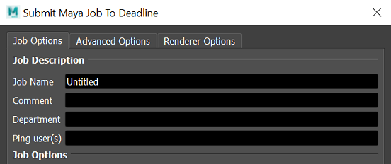
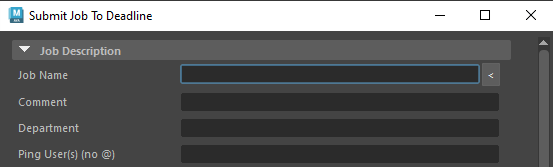

# Deadline2Discord
Discord bot for watching over a renderfarm, remotely!

At my job, I find myself to be absent from any PC when someone asks me to diagnose some render
in the system, and i do not want to log in remotely every time I have to make sure something is re-submitted.

Made with love for my students at HKU.

### Features:
- Managing jobs by discord username
- Getting useful job stats
- Job completion/fail notification
- Being notified upon job completion (requires registering your username with the bot)
- Automatic embedding of preview files
- Being able to requeue/reschedule jobs, even going so far as to be able to modify parameters like targeted frame range and output files, for plugins that allow for it (so far autodesk plugins and blender)
- Job ownership! No other people messing with your renders. 

---
### Dependencies:
- Discord.py
- TinyDb
- A running breathing living Deadline setup

### Basic usage:

1. Copy the contents of the Deadline/events/Discord folder to your repository events plugin folder.<br>
(Usually `REPOSITORY/events/Discord` or `REPOSITORY/custom/events/Discord`)
1. Make sure your Deadline setup is also running the web service.
1. Synchronise plugins from the super user Tools menu in Deadline Monitor, and make sure to set your hostname there to the name of the computer you will be sending things towards, and make sure the state is set to Global Enabled.
1. Go to discord developer portal, create a bot, generate a token, set up permissions for posting and embedding stuff.
1. Run the bot for the first time, and set up the appropriate guild (channel ID number) and channel ID for the bot to post in, as well as the token and the ports the it should run on. If you are running the deadline web service on a different port, specify it as well, and you may modify the port this service runs on as well, standard is 1337.

---
### Advanced usage:
In order to profit off of the notification system, we need to modify our submission plugins to 
write out requested discord tags to the Job file.<br>
These scripts are found as `REPOSITORY/scripts/Submission/PluginNameSubmission.py`

In order to modify a plugin succesfully, you need the following components!<br>

### 1. Adding an element to the Interface:
In the top section of a script, you can always find the interface elements being added with an object called `scriptDialog`:
```py
# Adds a labeled textbox to an interface.
scriptDialog.AddControlToGrid( "CommentLabel", "LabelControl", "Comment", 2, 0, "A simple description of your job. This is optional and can be left blank.", False )
scriptDialog.AddControlToGrid( "CommentBox", "TextControl", "", 2, 1 )
```
The numbers reflect the number in the grid you are placing the control.<br>
I'm modifying Maya's submission plugin from deadline 10.3 that is used in the Monitor, so I am going to go below the department in the first interface element:
```py
# from line 71 >
scriptDialog.AddControlToGrid( "DepartmentLabel", "LabelControl", "Department", 3, 0, "The department you belong to. This is optional and can be left blank.", False )
scriptDialog.AddControlToGrid( "DepartmentBox", "TextControl", "", 3, 1 )

scriptDialog.AddControlToGrid( "PingLabel", "LabelControl", "Ping user(s)", 4, 0, "Discord user to ping / claim job.", False )
scriptDialog.AddControlToGrid( "PingBox", "TextControl", "", 4, 1 )

# ADD OUR INTERFACE ELEMENT.

scriptDialog.AddControlToGrid( "PingLabel", "LabelControl", "Ping user(s)", 7, 0, "Discord user(s) to ping / claim job.", False )
scriptDialog.AddControlToGrid( "PingBox", "TextControl", "", 7, 1 )
```
### 2. Making sure our element is available later:
The settings are gathered at a later time, and we need to add our setting to this as well
```py
# Many entries omitted due to length.
settings = ( "DepartmentBox","CategoryBox","PoolBox", ... , "PingBox")
```
### 3. Writing out the right key to the job file.
Now, we look for the `SubmitButtonPressed` method, and the `writer` object for the job within.
```py
for sceneFile in sceneFiles:
            # Create job info file.Fexecute
            jobInfoFilename = Path.Combine( ClientUtils.GetDeadlineTempPath(), "maya_job_info.job" )
            writer = StreamWriter( jobInfoFilename, False, Encoding.Unicode )
```
This writer object, in the following lines of code, writes out a whole bunch of stuff.
the name writer gets reused for a `StreamWriter` for the plugin info, so be sure to watch out to write before
it gets closed the first time.
```py
if groupBatch:
    writer.WriteLine( "BatchName=%s\n" % ( jobName ) )
## WE'RE GONNA INSERT HERE! ##
writer.Close()
            
# Create plugin info file.
pluginInfoFilename = Path.Combine( ClientUtils.GetDeadlineTempPath(), "maya_plugin_info.job" )
```
We need to write the new entry as `ExtraInfoKeyValue#=Name=Value`, where the `#` can be any number you want.
I am following the code style of the Deadline plugin for formatting, but know that f strings work just fine.<br>
The following is us jamming our earlier set up `PingBox` data in the job file that'll be used by the API.<br>
I remove all @'s, because we do not need them, and there might be a chance that artists might want to use them either way.
```py
if groupBatch:
    writer.WriteLine( "BatchName=%s\n" % ( jobName ) )

## vv Write ping data. vv ##
pingname = str(scriptDialog.GetValue("PingBox")).replace("@","")
writer.WriteLine("ExtraInfoKeyValue0=JobPing=%s" % pingname)
## ^^ Write ping data. ^^ ##

writer.Close()
```
With this, if some usernames are added, they are now appropriately tagged and given ownership of the job.<br>
This however, only works from deadline monitor, and things that straight up call the python submission script.

<br>
<i>Deadline Monitor's internal Maya submitter.</i>

The actual internal submitter that is called in Maya resides in `REPOSITORY/submission/Maya/Main/SubmitMayaToDeadline.mel`, 
a horrifying MEL script, just awful. 
I'm not going to detail it here but I basically shadowed what is being done with the department attribute.
You can find it in example_plugins/SubmitMayaToDeadline.mel.

<br>
<i>Maya's own mel based deadline submitter.</i>